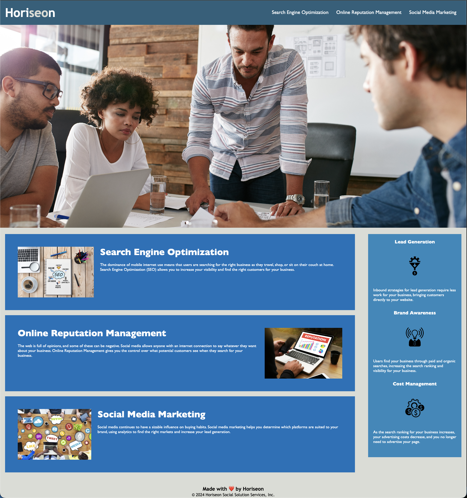

# Horiseon Challenge Webpage

## Description

The purpose of this challenge was to create a webpage using basic principles of HTML, CSS, and Git. Using what I've learned through the first week, I've created a webpage that follows accessibility standards, uses various selectors and other html elements, also implementing many CSS design styles. In the final part of this challenge, I implemented a public webpage from my github repository.

## Table of Contents (Optional)

- [Installation](#installation)
- [Usage](#usage)
- [Mock-Up](#mock-up)
- [Credits](#credits)
- [License](#license)

## Installation

N/A

## Usage

This webpage is intended to be optimized for search engines through the implementation of accessibility standards.

## Mock-Up

The following image shows the web application's appearance and functionality:

> **Note**: This layout is designed for desktop viewing, so you may notice that some of the elements don't look like the mock-up at a resolution smaller than 768px. Eventually you'll learn how to make elements responsive so that your web application is optimized for any screen size.

## Credits

N/A

## License

MIT License

Copyright (c) 2024 Sinnema1

Permission is hereby granted, free of charge, to any person obtaining a copy
of this software and associated documentation files (the "Software"), to deal
in the Software without restriction, including without limitation the rights
to use, copy, modify, merge, publish, distribute, sublicense, and/or sell
copies of the Software, and to permit persons to whom the Software is
furnished to do so, subject to the following conditions:

The above copyright notice and this permission notice shall be included in all
copies or substantial portions of the Software.

THE SOFTWARE IS PROVIDED "AS IS", WITHOUT WARRANTY OF ANY KIND, EXPRESS OR
IMPLIED, INCLUDING BUT NOT LIMITED TO THE WARRANTIES OF MERCHANTABILITY,
FITNESS FOR A PARTICULAR PURPOSE AND NONINFRINGEMENT. IN NO EVENT SHALL THE
AUTHORS OR COPYRIGHT HOLDERS BE LIABLE FOR ANY CLAIM, DAMAGES OR OTHER
LIABILITY, WHETHER IN AN ACTION OF CONTRACT, TORT OR OTHERWISE, ARISING FROM,
OUT OF OR IN CONNECTION WITH THE SOFTWARE OR THE USE OR OTHER DEALINGS IN THE
SOFTWARE.
